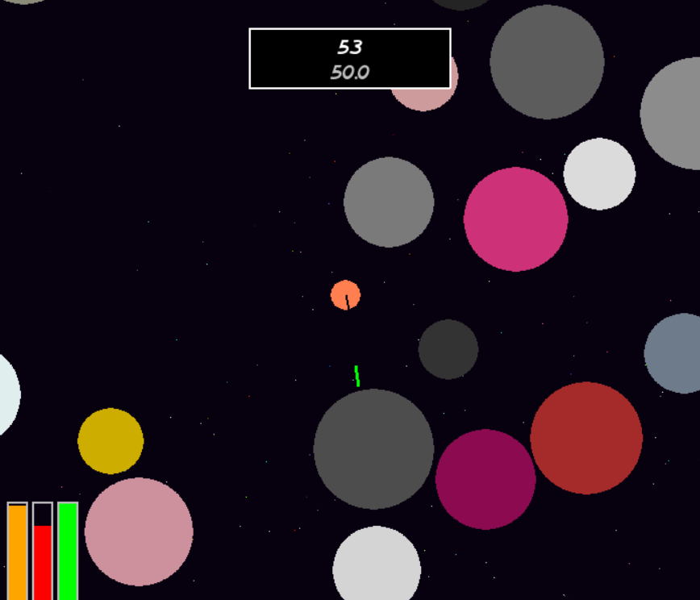

# Caleb's Python Project

This is a collection of projects made for CSS 155 A (Programming in Python) at Eastern Mennonite University. These projects were used to explore the pygame and pymunk libraries. Project included:

- pymunkarrows.py - A copy of the sample program provided with the pymunk library
- bouncinginspace.py - A program that simulates gravity and collisions between objects freely floating in space
- flyinginspace.py - A full-featured game similar to Asteroids, which uses physics simulations from pymunk alongside the pygame engine

# Screenshots
- [flyinginspace.py](flyinginspace.py)

# Installation
- Clone repository
    - `git clone https://github.com/NotQuiteAmish/programming-project-game.git`
- Set up virtual environment
    - `virtualenv venv`
    - `source ./venv/bin/activate` or `venv/Scripts/activate.bat` on Windows
    - `pip install -r requirements.txt` to install all required libraries
- Run project
    - `python flyinginspace.py`

# Update History
## Project 1 - November 7, 2019

Hello there, welcome to my project! I'm not entirely sure what my endgoal with this project is, but currently I am
working with the python library "pymunk". It is a physics engine that integrates well with pygame. It takes care of
collisions between objects, and it will also calculate any movement that I cause using forces and impulses.

The first project I made with this library is [bouncinginspace](bouncinginspace.py). It was made almost entirely from scratch, however
some barebones code snippets were taken from the pymunk example program [pymunkarrows](pymunkarrows.py). I included this in the
repository as a citation of sorts, but none of it is my original code.

[bouncinginspace](bouncinginspace.py) is a program that simulates several bodies floating in space. You can input force by clicking to send a
ball crashing into the planets. However, there is also additionally an option to enable gravity. The gravity code was
written entirely by me. Essentially, the code will loop through all of the objects on the screen and calculate the
gravitational interaction between them, and apply forces accordingly. The gravity can be turned up or down using the
arrow keys, or turned off entirely using the space bar.

Overall, I am very satisfied with how this turned out! I spent about 2 hours interacting with the example program to
familiarize myself with the library, and about 5 hours coding the program itself, as well as an hour or so on other aspects
of the program, such as setting up git to interact with GitHub, or downloading and creating assets for the program.

(Note - you may need to do "pip install pymunk" to get this to work. I haven't looked at all at how libraries work on
other peoples' machines)

## Project 2 - November 14, 2019

The new part of my project this week is [flyinginspace](flyinginspace.py). I think my end goal for this project will be some game that
takes place in space. So, I want to be able to move around freely in the space and have the camera track the player
wherever they move.

The majority of the work on this program were the following things:
    - Code to make the camera follow the player
    - Code to generate stars in the background of space
    - Making pymunk work well with pygame in complex situations
    - Further practice with git and GitHub.

In all, I think I spent about 7 hours on this project between my last presentation on Monday, 11/11, and today,
Thursday, 11/14. All of the code is original except for small bare bones bits I used from [bouncinginspace](bouncinginspace.py). I did a
*lot* of documentation so hopefully its commented well enough

## Project 3 - December 6, 2019
Here it is, the final project!

Before I go into this, all of the interesting stuff is in [flyinginspace](flyinginspace.py) and resources. The rest of the files are
old.

Since the last project, I added planets! These are more like asteroids, really, but they are called planets in the code.
These will damage the player if they fly into them too fast. I also added functionality for the laser gun. When the
player presses spacebar, they fire a laser that can destroy planets. This gives the player points.

There is also game functionality, such as a menu, timer, score, gauges, and game-over conditions. This was tons of fun
to create, and I especially had fun creating all of the sound effects (except the music, that was royalty free). As a
result I spent 15 hours or so on this project, just having fun with it. If I had more time, I would have loved to make a
multiplayer game over the network, but I just did not have enough time to make that commitment.

